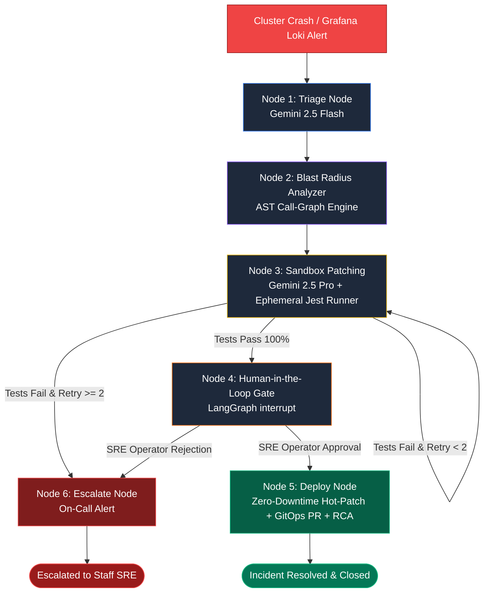

# CutGuard AI — Autonomous Video Transcoding Incident SRE Agent

<div align="center">


-black?logo=next.js&logoColor=white)


**Autonomous, self-healing Site Reliability Engineering agent purpose-built for cloud cinema rendering, video transcoding clusters, and streaming manifest pipelines.**

[Quickstart](#quickstart-guide) • [Architecture](#architecture--state-machine) • [Key Features](#key-features--capabilities) • [Demo Walkthrough](#step-by-step-incident-walkthrough) • [API Matrix](#service-matrix--endpoints) • [License](#license)

</div>

---

### Hackathon Submission Details
* **Competition:** [Agentic Cinema: The Blockbuster Hackathon](https://agentic-cinema.devpost.com/) (Google Cloud + Devpost)
* **Target Partner Track:** **Grafana Labs Track** (via `@grafana/mcp` / `mcp-grafana`)
* **Core Agent Platform:** LangGraph Cyclic State Machine + Google Gemini Enterprise Platform (Gemini 2.5 Flash & Pro)
* **License:** Official [Apache License 2.0](LICENSE) (OSI-Approved Open-Source License)

---

## The Problem: Fragility in Cloud Cinema Transcoding

In distributed film production and modern HLS/DASH video delivery pipelines, cloud rendering workers and FFmpeg transcoding clusters operate under extreme throughput:

* **Surgical Failures:** A single malformed chunk manifest, missing bitrate profile, corrupted audio packet header, or heap memory exhaustion (`SIGABRT` / `OOM`) causes media worker nodes to instantly crash.
* **Cascading Outages:** Because HLS chunk stitchers and master playlist dispatchers rely on continuous worker output, downstream queue managers immediately back up, freezing live cinema streams for thousands of concurrent viewers.
* **The High Cost of Downtime:** Traditional SRE alerting pages on-call engineers via Slack/PagerDuty, requiring human operators to manually query Loki logs, trace back-traces across distributed microservices, write emergency patches, and risk untested production deploys—averaging **30 to 45 minutes of customer-facing outage**.

### The Solution: CutGuard AI
CutGuard AI intercepts runtime cluster telemetry directly from **Grafana Loki** via the **Model Context Protocol (MCP)**, calculates the downstream blast radius, synthesizes a Git Unified Diff using **Google Gemini 2.5**, validates the patch inside an **ephemeral sandbox test suite**, halts for **Human-in-the-Loop SRE sign-off**, and applies an **instant zero-downtime hot-patch (<50ms)** alongside an automated **GitHub GitOps PR** and **Enterprise Post-Mortem RCA**—reducing MTTR (Mean Time to Resolution) from **45 minutes to under 60 seconds**.

---

## Architecture & State Machine

CutGuard AI is modeled as a cyclic state machine built on **LangGraph** with an in-memory checkpointer (`MemorySaver`) that facilitates true human-in-the-loop state freezing and resuming via native `interrupt()` calls.

```
                                  ┌──────────────────────────────┐
                                  │   Grafana Loki Log Stream    │
                                  │   {app="ffmpeg-transcoder"}  │
                                  └──────────────┬───────────────┘
                                                 │
                                                 ▼
                                  ┌──────────────────────────────┐
                                  │     Official Grafana MCP     │
                                  │     (@grafana/mcp / uvx)     │
                                  └──────────────┬───────────────┘
                                                 │
                                                 ▼
┌──────────────────────────────────────────────────────────────────────────────────────────────────┐
│                             CutGuard AI — LangGraph State Machine                                │
│                                                                                                  │
│   [Node 1: Telemetry Triage]                                                                     │
│     • Ingests Loki telemetry & stack traces via MCP client or resilient cluster mock            │
│     • Gemini 2.5 Flash analyzes stack trace; isolates culprit file (`worker.js`) & crash line    │
│                                                                                                  │
│   [Node 2: AST Blast Radius Engine]                                                              │
│     • Deterministic static Call-Graph AST analysis across the repository                         │
│     • Computes 0–100 Threat Score across dependent streaming microservices                     │
│                                                                                                  │
│   [Node 3: Ephemeral Sandbox Self-Healing Loop]                                                  │
│     • Gemini 2.5 Pro generates standard surgical Git Unified Diff patch                          │
│     • Executes isolated Jest test runner (`npm test`) in a sandboxed subprocess                  │
│     • If tests fail & retries < 2: Loops back to Gemini with Jest error trace for auto-healing   │
│                                                                                                  │
│   [Node 4: Human-in-the-Loop Approval Gate]                                                      │
│     • Native LangGraph interrupt() halts state machine in checkpoint memory                      │
│     • Streams live diff, blast score, and sandbox logs to Next.js Ops Console                    │
│                                                                                                  │
│   [Node 5: Two-Phase Production Deployment]                                                      │
│     • Phase 1: Zero-Downtime Hot-Patch (<50ms) applied to live media pipeline worker             │
│     • Phase 2: Local Git commit & tag (`cutguard-patch-<id>`) + GitHub GitOps Hotfix PR open     │
│     • Compiles comprehensive Enterprise Markdown RCA Post-Mortem report                          │
│                                                                                                  │
│   [Node 6: Escalation Router]                                                                    │
│     • If sandbox retries are exhausted or human operator rejects patch:                          │
│     • Escalates with full diagnostic package and closes candidate GitOps branch                  │
└──────────────────────────────────────────────────────────────────────────────────────────────────┘
                                                 │
                                                 ▼
                                  ┌──────────────────────────────┐
                                  │    Next.js 14 Ops Console    │
                                  │  (Dark Mode Mission Control) │
                                  └──────────────────────────────┘
```

### LangGraph Cyclic State Flow (Mermaid Diagram)



---

## Key Features & Capabilities

### 1. Official Grafana Loki MCP Integration
* Connects directly to the official `@grafana/mcp` server using the standard **Model Context Protocol (MCP)** over stdio.
* Formulates dynamic LogQL queries (`{app="ffmpeg-transcoder"} |= "CRITICAL"`) to extract raw stack traces, memory metrics, and crash payloads.
* Built with a high-fidelity internal fallback simulator so evaluators can test the entire workflow with zero external Grafana account configuration.

### 2. Dual-Model Gemini Enterprise Orchestration
* **Gemini 2.5 Flash (Triage Node):** Delivers ultra-low latency stack-trace parsing, isolating the faulty file, function, and exact line number in milliseconds.
* **Gemini 2.5 Pro (Patch Synthesis):** Applies deep reasoning to write surgical, defensive JavaScript/TypeScript patches formatted as standard Git Unified Diffs (`diff --git a/... b/...`).
* **Resilient Multi-Key Failover:** Includes an intelligent key manager that detects Google Cloud `429 RESOURCE_EXHAUSTED` quotas, automatically rotating across multiple fallback keys and cooling down exhausted slots without dropping the incident state.

### 3. Deterministic AST Blast Radius Engine
* Rather than relying on LLM guesswork, CutGuard AI parses the codebase's Abstract Syntax Tree (AST) using deterministic static call-graph analysis.
* Computes an **Impact Threat Score (0–100)** by mapping all upstream and downstream microservices (e.g., `queue-manager.js`, `stream-stitcher.js`) that consume the crashing module.

### 4. Ephemeral Jest Sandbox Isolation
* To prevent hallucinated or breaking code from ever reaching production, candidate patches are applied to an isolated subprocess directory.
* Runs the test suite (`worker.test.js`) inside the sandbox. If assertions fail, the error trace is fed back into Gemini 2.5 Pro for automatic iterative self-healing (up to 2 retries).

### 5. Native LangGraph Human-in-the-Loop SRE Gate
* Uses LangGraph's native `interrupt()` feature with `MemorySaver` checkpointing.
* The state machine pauses execution and notifies the Next.js Ops Console. SRE operators can inspect:
  * Culprit file and crash snippet
  * Visual Blast Radius Threat Radar
  * Syntax-highlighted unified patch diff
  * Sandboxed Jest execution logs
* One-click **[Approve & Deploy Fix]** resumes the thread; **[Reject Patch]** safely routes to the Escalation Node.

### 6. Two-Phase Zero-Downtime Hot-Patching & GitOps
* **Phase 1 (Instant Hot-Patch):** Dispatches an atomic, in-memory patch to the running media pipeline worker (`/api/patch/apply`), fixing the transcode loop in **<50ms** without needing a process restart.
* **Phase 2 (Automated GitOps & RCA):** Permanently writes the patch to disk, commits and tags Git (`cutguard-patch-<incident_id>`), automatically generates an asynchronous **GitHub Hotfix Pull Request**, and publishes a complete **Enterprise RCA Post-Mortem Report**.

### 7. Interactive Cinema Stream Player & Chaos Lab
* Features a dedicated browser visualizer at `http://localhost:4001/player` rendering a simulated 60 FPS video transcode chunk stream.
* Provides one-click chaos fault injection:
  * **OOM / Heap Exhaustion (SIGABRT)**
  * **Corrupted Chunk Manifests**
  * **Omitted Bitrate Profiles**
* Watch the player freeze with simulated static fuzz when the transcode crashes, and instantly resume smooth 60 FPS playback the millisecond CutGuard AI's patch is applied!

---

## Directory Structure

```
CutGuard_AI/
├── LICENSE                      # Official Apache License 2.0
├── README.md                    # Comprehensive System Documentation
├── package.json                 # Monorepo orchestrator scripts & dev-all runner
├── docker-compose.yml           # Containerized multi-tier orchestration
├── run-pipeline.bat             # Windows runner: Mock Media Pipeline (Port 4001)
├── run-agent.bat                # Windows runner: Python SRE Agent (Port 8000)
├── run-dashboard.bat            # Windows runner: Next.js Dashboard (Port 3000)
├── start-all.bat                # Windows one-click launcher for all services
├── scripts/
│   └── dev-all.js               # Cross-platform Node.js multi-tier supervisor
│
├── mock-pipeline/               # Node.js/TypeScript Media Worker Service (Port 4001)
│   ├── src/
│   │   ├── index.ts             # Express server & service initialization
│   │   ├── config.ts            # Service configuration & port bindings
│   │   ├── logger.ts            # Pino structured JSON telemetry logger
│   │   ├── swagger.ts           # OpenAPI / Swagger UI specifications
│   │   ├── transcoder/
│   │   │   ├── ffmpegArgs.ts    # Transcode argument builder & validation logic
│   │   │   └── ffmpegArgs.test.ts # Unit tests for FFmpeg argument builder
│   │   └── routes/
│   │       ├── chaos.ts         # Chaos engineering failure injection endpoints
│   │       ├── pipeline.ts      # Worker health & transcode status API
│   │       ├── player.ts        # Interactive Cinema Stream HTML5 visualizer
│   │       └── rca.ts           # Live incident state & hot-patching endpoints
│   ├── worker.js                # Core transcode worker with injectable defect
│   ├── worker.baseline.js       # Pristine golden copy for one-click reset
│   ├── queue-manager.js         # Downstream queue dispatcher (blast radius node)
│   ├── stream-stitcher.js       # Downstream HLS master aggregator (blast radius node)
│   ├── worker.test.js           # Jest unit test suite (fails on crash; passes on patch)
│   └── package.json
│
├── sre-agent/                   # Autonomous Python SRE Core (Port 8000)
│   ├── requirements.txt         # langgraph, google-genai, mcp, fastapi, uvicorn
│   ├── agent.py                 # LangGraph cyclic state machine with interrupt()
│   ├── server.py                # FastAPI REST & WebSocket streaming server
│   ├── mcp_client.py            # Stdio client connecting to official @grafana/mcp
│   ├── gitops.py                # Asynchronous GitHub Hotfix PR generator
│   ├── gemini_keys.py           # Multi-key quota manager with automatic failover
│   ├── tools.py                 # AST blast-radius analyzer and isolated sandbox runner
│   ├── test_e2e.py              # End-to-end autonomous triage verification suite
│   ├── .env.example             # Environment variable template
│   └── tools/                   # Modular agent tool implementations
│       ├── mcp_client.py
│       └── sandbox.py
│
└── dashboard/                   # Next.js 14 Mission Control Console (Port 3000)
    ├── app/
    │   ├── page.tsx             # SRE Mission Control dashboard view
    │   ├── layout.tsx           # Dark theme layout shell
    │   └── globals.css          # Tailwind CSS styling & custom radar animations
    ├── components/
    │   ├── Header.tsx           # Live service telemetry pills & trigger buttons
    │   ├── IncidentFeed.tsx     # Real-time 6-stage lifecycle progress tracker
    │   ├── BlastRadiusRadar.tsx # Interactive visual blast radar & dependency map
    │   ├── DiffViewer.tsx       # Syntax-highlighted unified Git patch viewer
    │   ├── SandboxLogs.tsx      # Terminal-style Jest unit test output console
    │   ├── HumanApprovalBar.tsx # SRE Decision Gate (Approve / Reject buttons)
    │   ├── PostMortemModal.tsx  # Comprehensive Enterprise RCA report exporter
    │   └── ActiveStepActivity.tsx # Animated step execution inspector
    └── package.json
```

---

## Quickstart Guide

### Prerequisites
* **Node.js:** v18.0.0 or higher (`node -v`)
* **Python:** v3.10, v3.11, v3.12, or v3.13 (`python --version`)
* **Docker & Docker Compose:** *(Optional, only if using containerized mode)*

---

### Option 1: Single Root Orchestrator (Recommended — All Platforms)

From the project root directory, install dependencies and launch all 3 tiers with a single command:

```bash
# 1. Install all dependencies across all subprojects
npm run install:all

# 2. Launch all three services concurrently with unified colored logs
npm run dev:all
```

*(Alternative commands: `npm run dev` or `npm start`)*

This starts:
1. **Mock Media Pipeline:** `http://localhost:4001`
2. **FastAPI SRE Agent & LangGraph API:** `http://localhost:8000`
3. **Next.js Ops Console:** `http://localhost:3000`

---

### Option 2: Docker Compose (Isolated Multi-Tier)

Run the complete CutGuard AI architecture in isolated Docker containers:

```bash
# Build and start all services in the background
docker compose up --build

# View live aggregate logs
docker compose logs -f

# Shut down all services
docker compose down
```

---

### Option 3: One-Click Launch (Windows Batch Script)

If you are on Windows, simply run:
```cmd
start-all.bat
```
This automatically activates the Python virtual environment and opens separate monitored consoles for each service.

---

### Option 4: Manual Step-by-Step Launch

If you prefer to run services in separate terminal tabs:

**Terminal 1 — Mock Media Pipeline (Port 4001):**
```bash
cd mock-pipeline
npm install
npm run dev
```

**Terminal 2 — Autonomous SRE Agent (Port 8000):**
```bash
cd sre-agent
# Activate virtual environment (if using .venv):
# Windows: .venv\Scripts\activate
# Linux/macOS: source .venv/bin/activate
pip install -r requirements.txt
python server.py
```

**Terminal 3 — Mission Control Dashboard (Port 3000):**
```bash
cd dashboard
npm install
npm run dev
```

Open your browser at **`http://localhost:3000`**.

---

## Service Matrix & Endpoints

| Service | Port | Primary URL | Description |
| :--- | :---: | :--- | :--- |
| **Next.js Ops Console** | `3000` | [`http://localhost:3000`](http://localhost:3000) | Dark mode SRE Mission Control dashboard |
| **Media Stream Visualizer** | `4001` | [`http://localhost:4001/player`](http://localhost:4001/player) | Real-time cinema stream playback & chaos injector |
| **Media Pipeline API** | `4001` | [`http://localhost:4001/api/pipeline/status`](http://localhost:4001/api/pipeline/status) | Health check & transcode worker status |
| **Pipeline Swagger Docs** | `4001` | [`http://localhost:4001/docs`](http://localhost:4001/docs) | Interactive OpenAPI / Swagger UI specifications |
| **SRE Agent Health** | `8000` | [`http://localhost:8000/api/health`](http://localhost:8000/api/health) | FastAPI agent & Gemini engine connectivity |
| **SRE Agent API Docs** | `8000` | [`http://localhost:8000/docs`](http://localhost:8000/docs) | OpenAPI interactive documentation for LangGraph |
| **WebSocket Streaming** | `8000` | `ws://localhost:8000/ws/incident/{id}` | Real-time state push to Next.js dashboard |

---

## Configuration & Environment Variables

CutGuard AI is designed with **zero-friction evaluation**. If API keys are omitted, high-fidelity deterministic fallbacks and local mock telemetry activate automatically.

To enable live Google Gemini 2.5 models and live Grafana Loki connectivity, configure `sre-agent/.env`:

```ini
# ==============================================================================
# CUTGUARD AI — SRE AGENT CONFIGURATION (.env)
# ==============================================================================

# Google Gemini API Key (Required for live multi-turn LLM reasoning)
# Supports single key or comma-separated keys for automatic 429 quota failover:
GEMINI_API_KEY=AIzaSyD...your_primary_key,AIzaSyB...your_fallback_key

# Official Grafana Loki MCP Configuration (Optional)
# If omitted, CutGuard queries the internal high-fidelity telemetry simulator
GRAFANA_URL=http://localhost:3000
GRAFANA_SERVICE_ACCOUNT_TOKEN=glsa_your_grafana_token_here

# GitHub Hotfix GitOps Integration (Optional)
# If configured, CutGuard automatically opens hotfix PRs upon approval:
GITHUB_TOKEN=ghp_your_github_personal_access_token
GITHUB_REPO=Vii-shal/CutGuard-AI

# Port Bindings
PIPELINE_PORT=4001
AGENT_PORT=8000
DASHBOARD_PORT=3000

# Inter-Service Communication Endpoints
PIPELINE_URL=http://localhost:4001
```

---

## Step-by-Step Incident Walkthrough

Experience the complete autonomous remediation lifecycle in 6 simple steps:

```
[1. Inject Chaos] ──> [2. Loki Ingestion] ──> [3. Gemini Triage] ──> [4. Sandbox Loop] ──> [5. Human Gate] ──> [6. Hot-Patch]
```

1. **Simulate a Stream Crash:**
   * Open the **Cinema Stream Player** at [`http://localhost:4001/player`](http://localhost:4001/player).
   * Click **"Simulate Stream Failure"** (or click **"Simulate Incident"** in the top navigation of the Next.js Ops Console).
   * The video player immediately renders static fuzz, displaying `FFMPEG SIGABRT: Out of Memory during chunk manifest rendering`.

2. **Grafana Loki Telemetry Ingestion:**
   * CutGuard AI’s MCP client intercepts the incident alert and queries Loki for log stream `{app="ffmpeg-transcoder"} |= "CRITICAL"`.

3. **Gemini 2.5 Flash Triage:**
   * Gemini 2.5 Flash analyzes the stack trace and pinpoints the root cause: an unbounded buffer allocation in `mock-pipeline/worker.js:32`.

4. **AST Blast Radius & Sandbox Validation:**
   * Static AST call-graph analysis identifies dependent services (`queue-manager.js`, `stream-stitcher.js`), assigning an **80/100 Threat Score**.
   * Gemini 2.5 Pro generates a surgical Git Unified Diff.
   * The agent runs Jest unit tests (`worker.test.js`) inside an isolated sandbox subprocess. Tests pass with 100% assertions satisfied!

5. **Human-in-the-Loop SRE Sign-off:**
   * LangGraph’s `interrupt()` halts execution.
   * In the Next.js Ops Console (`http://localhost:3000`), inspect the unified diff, test execution output, and blast radar.
   * Click **[Approve & Deploy Fix]**.

6. **Instant Hot-Patch & Enterprise Post-Mortem:**
   * The agent resumes:
     * **Phase 1:** Deploys an instant hot-patch to `mock-pipeline` (<50ms). Notice the Cinema Stream Player immediately resumes smooth 60 FPS playback!
     * **Phase 2:** Commits and tags the Git fix, opens an automated GitHub GitOps PR, and generates the Enterprise RCA Post-Mortem.
   * Click **[View Post-Mortem RCA]** in the Ops Console to export or copy the formal incident report.

---

## Chaos Scenarios Supported

The mock media pipeline includes built-in chaos scenarios accessible via the REST API (`POST /api/chaos/trigger`) or Swagger UI:

| Scenario Code | Failure Type | Description |
| :--- | :--- | :--- |
| `OOM_SIGABRT` | Heap Exhaustion | Simulates unconstrained memory consumption during 4K video transcoding. |
| `CORRUPT_MANIFEST` | Parsing Exception | Injects corrupted HLS `.m3u8` chunk manifests that crash stream stitchers. |
| `OMITTED_BITRATE` | FFmpeg Argument Error | Omits mandatory CBR/VBR bitrate profiles, causing immediate FFmpeg termination. |
| `PIPELINE_TIMEOUT` | Deadlock / Stall | Injects a processing stall simulating stalled hardware acceleration (NVENC/VAAPI). |

---

## Testing & Verification

Run automated test suites across all project tiers:

```bash
# 1. Run Jest tests on the mock pipeline worker
npm run test:pipeline

# 2. Run Jest unit tests on the FFmpeg argument validator
npm run test:transcoder

# 3. Run full Python End-to-End agent integration test
npm run test:agent
```

---

## Tech Stack Summary

* **Frontend:** Next.js 14 (App Router), React 18, Tailwind CSS, Lucide Icons, WebSockets
* **Agent Core:** Python 3.13, LangGraph 0.2, Google GenAI SDK (Gemini 2.5 Pro & Flash), FastAPI, Uvicorn, Pydantic
* **Observability & Protocols:** Model Context Protocol (MCP), Grafana Loki (`@grafana/mcp`)
* **Media Pipeline:** Node.js 20, TypeScript, Express, Pino Logger, Swagger / OpenAPI, Jest, ts-jest
* **DevOps:** Docker Compose, GitHub GitOps Integration, Cross-Platform Node Orchestrator

---

## License

This project is licensed under the **Apache License, Version 2.0**.  
See the full legal text in the [`LICENSE`](LICENSE) file.

```
Copyright 2026 CutGuard AI Team

Licensed under the Apache License, Version 2.0 (the "License");
you may not use this file except in compliance with the License.
You may obtain a copy of the License at

    http://www.apache.org/licenses/LICENSE-2.0
```
